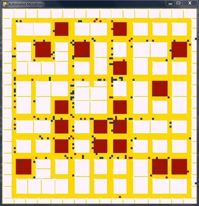

mondrian
========

Experiment with Artificial Societies and basic city generation. Visual inspired by Piet Mondrian's Broadway Boogie Woogie

Cities are generated from simple street pattens. Houses and markets are derived from streets. Each agent (or citizen) is allocated to a house, and moves randomly in the city. Agents increase their health finding food (i.e. in markets). 

A Floyd algorithm ensures real-time pathfinding to lead each agents through a graph automatically deduced from the city structure. During motion, agents use also a simple avoidance technique.

Simulation parameters: {city size, number of citizens}
